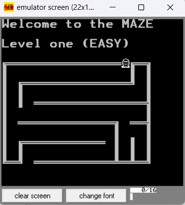
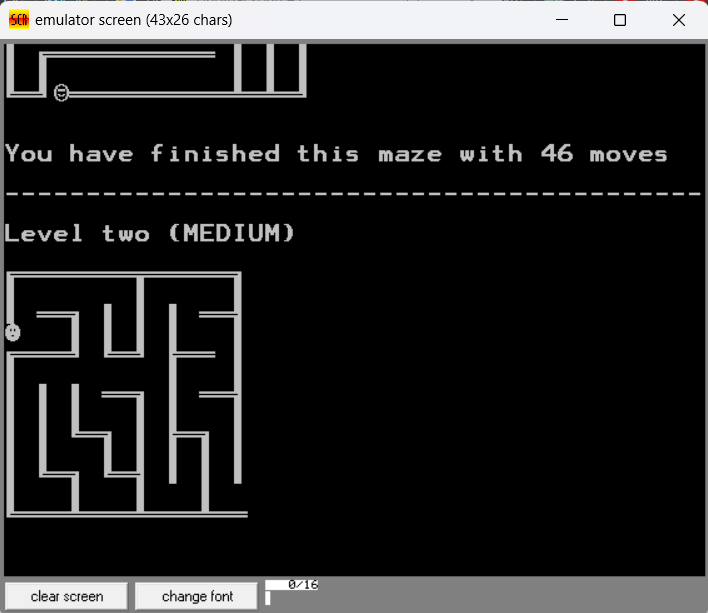
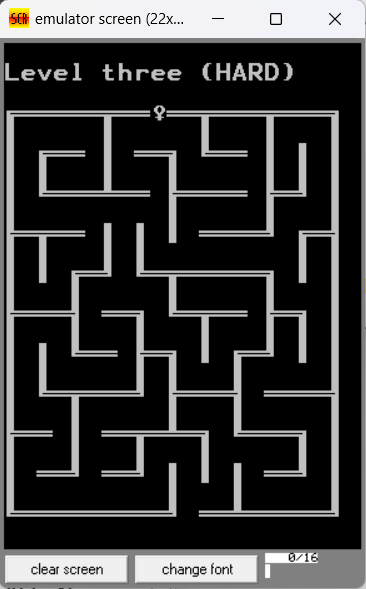
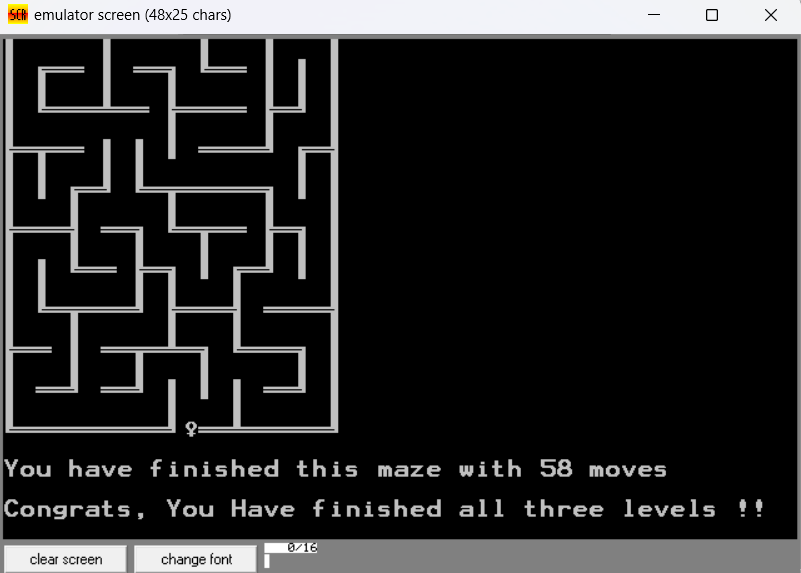

# Maze Game in Assembly Language
This repository contains the source code for a classic Maze game, written in x86 assembly language. The game features three distinct levels of mazes. The player begins at a starting point in the maze, and navigates through the maze to reach an exit. When the exit is reached, the game displays the number of moves the player took to finish the maze. The next level then starts with a new maze.

## Features
1. **Multiple Levels**: The game contains three different mazes, each providing a unique challenge.
2. **Move Counter**: The game counts and displays the number of moves it took the player to finish each maze.
3. **Dynamic Display**: The game is designed to be visually appealing, with the maze and player's position being updated in real-time as the player navigates the maze.
## How to Run
The game is written in x86 assembly language and requires an x86 assembler to compile and run. The specific assembler and instructions to compile and run the game may vary based on your specific system and setup.

## Game Controls
The player is moved through the maze using the following controls:

- **Up**: Move up.  
- **Down**: Move down.  
- **Left**: Move left.  
- **Right**: Move right.

##  Screenshots
### Level 1

### Level 2

### Level 3

### Done

## Contributions
Feel free to dive in! Open an issue or submit PRs. This game is still in development so suggestions and contributions are welcome.

## License
__MIT__ © _Qosay Al-Shatel_
